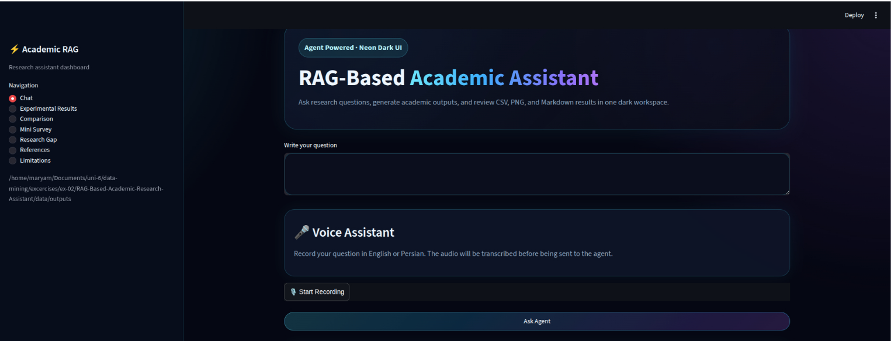
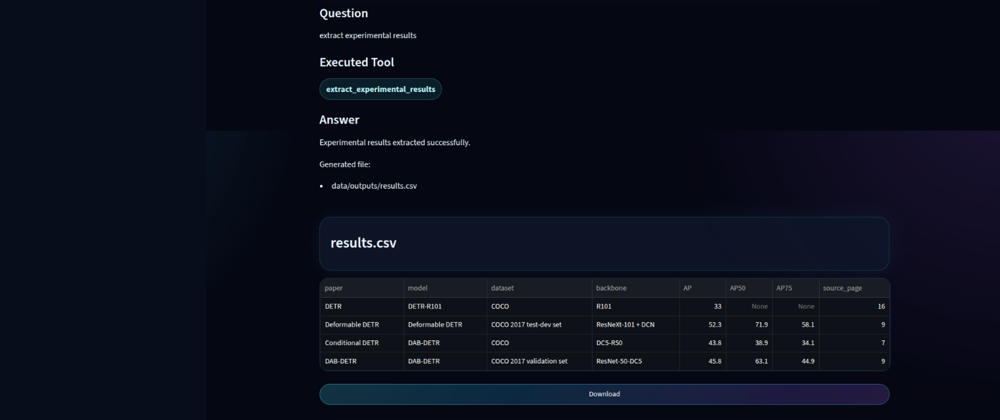
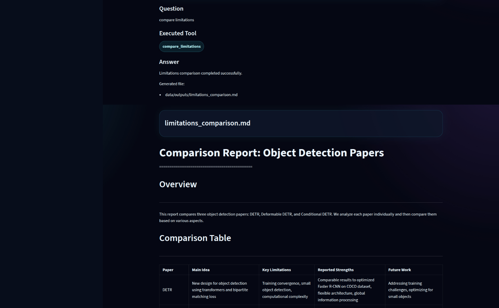
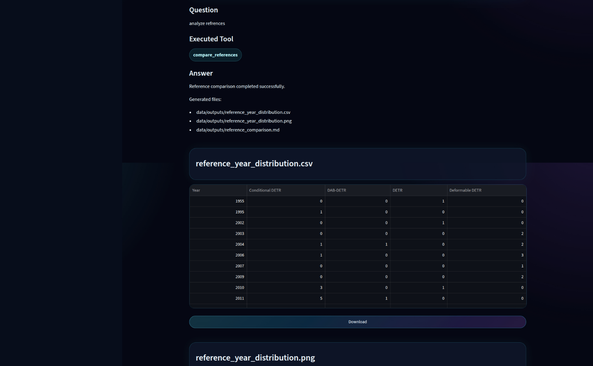
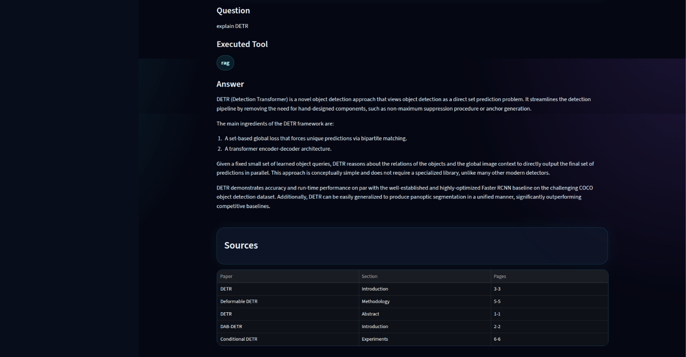

# Academic RAG Research Assistant

A local Retrieval-Augmented Generation (RAG) system for analyzing academic papers. The project combines semantic search, an LLM-powered agent, and several research analysis tools to answer questions, compare papers, extract experimental results, generate literature surveys, and analyze references and research gaps.

The entire system runs locally using **Ollama**, **ChromaDB**, and **Faster-Whisper**, providing an offline academic assistant with optional voice interaction.



---

# Features

## Retrieval-Augmented Generation (RAG)

* Semantic search over research papers
* Two-stage retrieval and reranking
* Source-aware answers with page references
* Local vector database using ChromaDB
* Offline LLM inference using Ollama

---

## Intelligent Agent

The system includes an LLM-powered agent that determines the user's intent and automatically chooses the correct tool.

Supported tools:

* RAG Question Answering
* Experimental Result Extraction
* Experimental Result Comparison
* Mini Literature Survey Generation
* Research Gap Analysis
* Reference Comparison
* Limitation Comparison

If no specialized tool is appropriate, the agent automatically falls back to standard RAG question answering.

## Examples

- Experimental Result Extraction



- Compare Limitations



- Compare Refrences
  


- Rag
  


---

## Experimental Result Extraction

Automatically extracts experimental results from the papers.

Information extracted includes:

* Paper title
* Model
* Dataset
* Backbone
* Evaluation metrics (AP, AP50, AP75, Accuracy, IoU, F1, etc.)
* Source page

Output:

```
data/outputs/results.csv
```

---

## Experimental Result Comparison

Compares extracted results across papers.

Outputs include:

* Comparison tables
* Performance visualization
* Markdown analysis

Generated files:

```
comparison_table.csv
comparison_chart.png
comparison_analysis.md
```

---

## Mini Literature Survey

Automatically generates a concise literature survey including:

* Main contribution
* Proposed method
* Experimental findings
* Strengths
* Overall comparison

Output:

```
mini_survey.md
```

---

## Research Gap Analysis

Analyzes conclusion and future work sections to identify:

* Current limitations
* Open research problems
* Suggested future work

Output:

```
research_gap.md
```

---

## Reference Comparison

Analyzes the references of every paper and generates:

* Publication year statistics
* Historical comparison
* Reference distribution chart

Outputs:

```
reference_year_distribution.csv
reference_year_distribution.png
reference_comparison.md
```

---

## Limitation Comparison

Extracts and compares limitations discussed by each paper.

Comparison includes:

* Performance
* Computational Cost
* Generalization
* Robustness
* Future Improvements

Output:

```
limitations_comparison.md
```

---

## Voice Assistant

The system also supports voice interaction using Faster-Whisper.

Supported languages:

* English
* Persian

Pipeline:

```
Voice
    ↓
Speech-to-Text (Faster Whisper)
    ↓
Agent
    ↓
Tool Selection
    ↓
RAG / Analysis Tool
    ↓
Response
```

Voice queries are processed exactly the same as typed questions.

---


# Technologies

* Python
* Ollama
* Qwen3 14B
* ChromaDB
* Faster-Whisper
* Sentence Transformers (multilingual-e5-small)
* Streamlit
* Pandas
* Matplotlib
* NumPy

---

# Download Models

Install Ollama

```bash
https://ollama.com/
```

Download the LLM

```bash
ollama pull llama3.2
```

Download the embedding model

```
multilingual-e5-small
```

Download Faster Whisper model

```
medium
```

or

```
large-v3
```

for improved multilingual transcription.

---

# Running the Project

Start Ollama

```bash
ollama serve
```

Run the Streamlit application

```bash
streamlit run app.py
```

---

# Outputs

Generated files are stored in

```
data/outputs/
```

Depending on the executed tool, outputs include:

* results.csv
* comparison_table.csv
* comparison_chart.png
* comparison_analysis.md
* mini_survey.md
* research_gap.md
* reference_year_distribution.csv
* reference_year_distribution.png
* reference_comparison.md
* limitations_comparison.md

---

# Performance

The system uses:

* Local LLM inference
* Semantic vector retrieval
* Metadata-aware reranking
* Automatic tool selection
* Offline speech recognition

This design minimizes unnecessary context sent to the LLM while improving response quality through retrieval and specialized analysis tools.

---

# Current Limitations

* Performance depends on chunk quality and retrieval accuracy.
* Different papers report different evaluation metrics, making direct comparison challenging.
* Whisper transcription for Persian is less accurate than English.
* Tool selection relies on the LLM and may occasionally misclassify ambiguous requests.
* Processing large collections of papers increases indexing and retrieval time.
* The system only answers questions using the indexed document collection.


